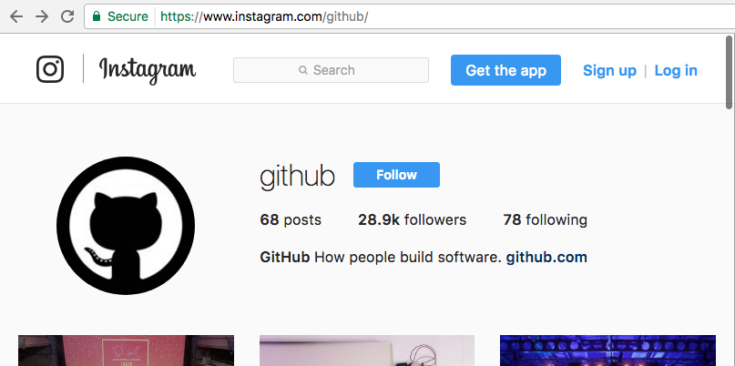
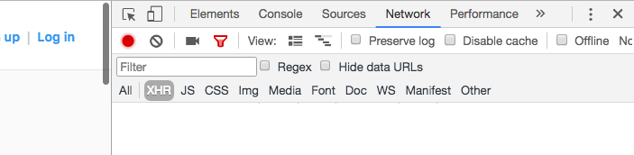
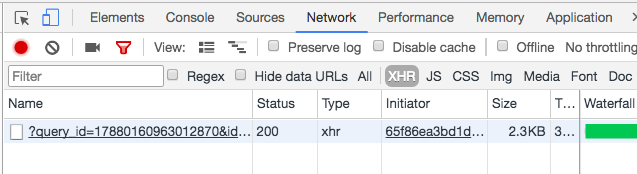

# Setup
## Installation
```shell
composer require mineur/instagram-parser:dev-master
```

## How to get your query hash (old: query id)
Instagram uses GraphQL for its API, and needs a mandatory parameter named 
`query_hash` to make the internal requests.

> Instagram also supports a parameter named `query_id` but since
> there is no easy way to get one, we'll keep the `query_hash` parameter
> instead.

This is an easy method to get your query hash. Once you get one, you don't need 
to worry about this anymore.

1. Run your browser and type `http://www.instagram.com/github/`.


2. Then, go to `Web Inspector > Network > xhr`.


3. Scroll down the page and click on **Load more** blue button.


4. Take a look at the following xhr query:


5. Copy the param `query_hash` like so, and keep it to build the parser.


## You're done!
Now you can go back with your query ID: [home readme](../README.md)